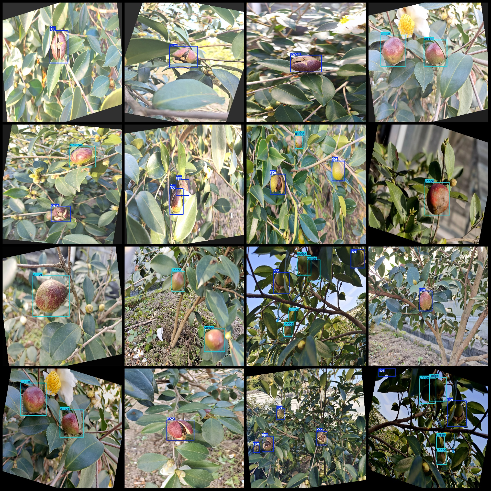
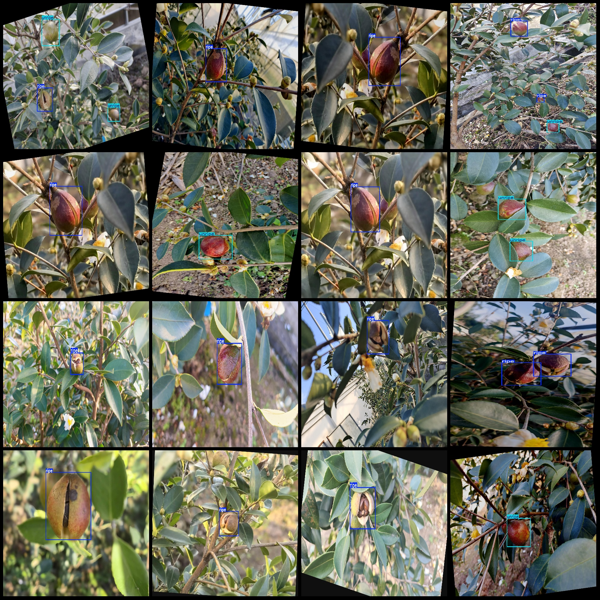

# Oil Tea Fruit Maturity Detection Dataset (VOC+YOLO Format) - 264 Images in 2 Classes

Note: Of the dataset, 110 images are originals, while the remaining are enhanced images generated using rotation augmentation algorithms.

Dataset format: Pascal VOC format + YOLO format (excluding the segmentation path in the txt file, only containing jpg images and corresponding VOC-format xml files, and yolo-format txt files).

Number of images (jpg file count): 264
Number of annotations (xml file count): 264
Number of annotations (txt file count): 264
Number of categories: 2
Annotation category names: ["ripe", "unripe"] (Note that the order of labels in the yolo format does not correspond with this, but is based on the classes.txt file in the labels folder.)

Each category has:
- Ripe box count = 296
- Unripe box count = 206
Total box count = 502

Each category occupies a number of images:
- Ripe occupies 200 images
- Unripe occupies 127 images

Image resolution: 2048x1536

Using labelImg for annotation:
Annotation rules: Drawing boxes around the categories.

Important notes: The dataset does not have been divided into training, validation, or test sets; you need to do so yourself.
Special declaration: This dataset does not guarantee the accuracy of the trained models or weight files.

Image previews:
Annotation examples:

## Images

Here is a pay link on Stripe ( https://buy.stripe.com/3cs8yP7sY87d0vu9AB ). Please contact me lonlonago@foxmail.com after funding $89, and I will send you a complete data files , thank you!

